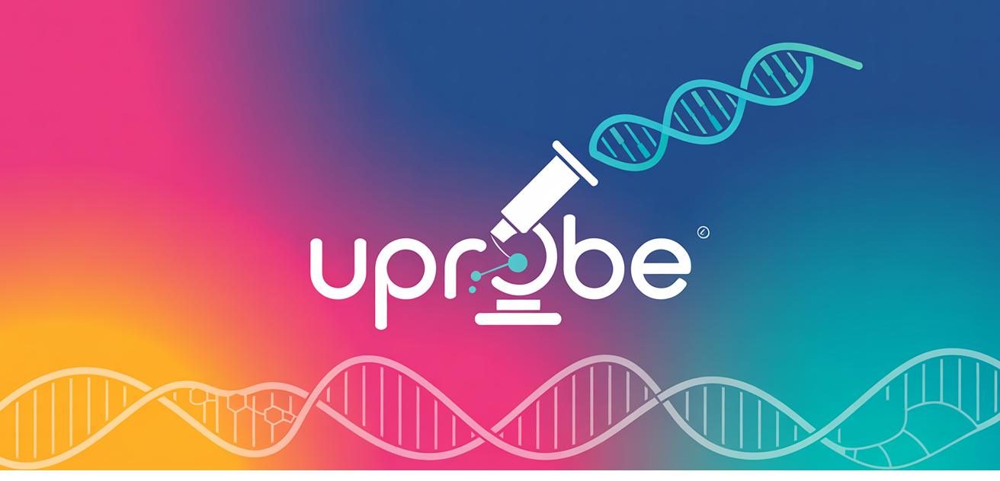

<h1 align="center">🧬 U-Probe: Universal Probe Design Tool</h1>

<div align="center">
  
</div>
<br>

- U-Probe is a powerful and flexible Python-based tool for designing custom DNA or RNA probes for various molecular biology applications, such as *in situ* hybridization and targeted sequencing. 
- It provides a comprehensive workflow from target gene selection to final probe generation, with a focus on automation, customization, and ease of use.

## Features

- **End-to-end workflow**: Automates the entire probe design process, from sequence extraction to final filtering.
- **Highly customizable**: Use simple YAML configuration files to define target genes, probe structures, and filtering criteria.
- **Advanced filtering**: Filter probes based on a wide range of attributes like GC content, melting temperature (Tm), and off-target potential.
- **Extensible API**: In addition to a command-line interface, U-Probe offers a clean Python API for programmatic access and integration into other bioinformatics pipelines.
- **Built-in indexing**: Automatically handles the creation of genome indices for alignment tools like Bowtie2 and BLAST.

## Installation

To get started with U-Probe, clone the repository and install the package.

### Install from source (Recommended)

```bash
git clone https://github.com/UFISH-Team/U-Probe.git
cd u-probe
pip install .
```

After installation, you can use U-Probe directly with the `uprobe` command.

### Development install

For development purposes, install in editable mode:

```bash
git clone https://github.com/UFISH-Team/U-Probe.git
cd u-probe
pip install -e .
```

### Using conda environment

```bash
git clone https://github.com/UFISH-Team/U-Probe.git
cd u-probe
conda env create -f environments.yaml
conda activate uprobe
pip install .
```

## Use guide

U-Probe provides two ways to use: Command Line Interface (CLI) and Python API.

### Pantheon REPL (interactive multi-agent)

If you want to use Pantheon directly (without the current U-Probe CLI and without
`uprobe.agent.api.UProbeAgentAPI`), you can bootstrap a workspace and start the
REPL with the U-Probe team loaded by default:

```bash
# Run in any work directory (this will install the team template into .pantheon/)
python -m uprobe.agent.repl_bootstrap
```

This will copy the team template to:

- `<workdir>/.pantheon/teams/uprobe_team.md`

And then launch:

- `python -m pantheon.repl --template <workdir>/.pantheon/teams/uprobe_team.md`

### Configuration Files

Before using U-Probe, you need to prepare two YAML configuration files:

1. **genomes.yaml** - Define genome information:
   ```yaml
   human_hg38:
     fasta: "/path/to/hg38.fa"
     gtf: "/path/to/gencode.v38.annotation.gtf"
     align_index: ["bowtie2", "blast"]
   ```

2. **protocol.yaml** - Define probe design parameters：
   ```yaml
   name: "MyExperiment"
   genome: "human_hg38"
   targets:
     - "GENE1"
     - "GENE2"
   extracts:
     target_region:
       source: "exon"
       overlap: 10
       length: 120
   # For more parameter configurations, please refer to tests/data/*.yaml
   ```

### Command Line Interface (CLI)

After installation, U-Probe provides a comprehensive CLI that can be accessed via the `uprobe` command.

#### Complete Workflow

One-click execution of the complete process from genome index construction to probe design:

```bash
uprobe run \
  --protocol protocol.yaml \
  --genomes genomes.yaml \
  --output ./results \
  --raw \
  --threads 10
```

#### Individual Step Execution

**1. Build Genome Index**
```bash
uprobe build-index \
  --protocol protocol.yaml \
  --genomes genomes.yaml \
  --threads 10
```

**2. Validate Target Genes**
```bash
uprobe validate-targets \
  --protocol protocol.yaml \
  --genomes genomes.yaml \
  --continue-invalid
```

**3. Generate Target Sequences**
```bash
uprobe generate-targets \
  --protocol protocol.yaml \
  --genomes genomes.yaml \
  --output ./results \
  --continue-invalid
```

**4. Construct Probes**
```bash
uprobe construct-probes \
  --protocol protocol.yaml \
  --genomes genomes.yaml \
  --targets ./results/target_sequences.csv \
  --output ./results
```

**5. Post-process Probes**
```bash
uprobe post-process \
  --protocol protocol.yaml \
  --genomes genomes.yaml \
  --probes ./results/combined_data.csv \
  --output ./results \
  --raw
```

**6. Generate Barcode Sequences**
```bash
uprobe generate-barcodes \
  --protocol protocol.yaml \
  --output ./barcodes
```

#### Common Parameters

| Parameter | Description |
|------|------|
| `--protocol, -p` | Path to probe design protocol configuration file (YAML) |
| `--genomes, -g` | Path to genome configuration file (YAML) |
| `--output, -o` | Output directory [default: ./results] |
| `--raw` | Save unfiltered raw probe data |
| `--continue-invalid` | Continue execution even if some targets are invalid |
| `--threads, -t` | Number of threads for computation [default: 10] |
| `--verbose, -v` | Enable verbose logging |
| `--quiet, -q` | Suppress all output except errors |

#### Get Help

```bash
# View all commands
uprobe --help

# View help for specific command
uprobe run --help

# Show version
uprobe version
```

#### Example Workflow with Individual Steps

```bash
# 1. First, build the genome index
uprobe build-index -p my_protocol.yaml -g my_genomes.yaml -t 8

# 2. Validate your target genes
uprobe validate-targets -p my_protocol.yaml -g my_genomes.yaml

# 3. Generate target sequences
uprobe generate-targets -p my_protocol.yaml -g my_genomes.yaml -o ./my_results

# 4. Construct probes from target sequences
uprobe construct-probes -p my_protocol.yaml -g my_genomes.yaml \
  --targets ./my_results/target_sequences.csv -o ./my_results

# 5. Post-process and filter probes
uprobe post-process -p my_protocol.yaml -g my_genomes.yaml \
  --probes ./my_results/combined_data.csv -o ./my_results --raw

# 6. Optional: Generate barcodes
uprobe generate-barcodes -p my_protocol.yaml -o ./barcodes
```

### Python API

U-Probe provides an object-oriented API for easy integration into other Python projects.

#### Basic Usage

```python
from pathlib import Path
from uprobe.api import UProbeAPI

# init
uprobe = UProbeAPI(
    protocol_config=Path("protocol.yaml"),
    genomes_config=Path("genomes.yaml"),
    output_dir=Path("./results")
)

# run 
probes_df = uprobe.run_workflow(
    raw_csv=True,
    continue_on_invalid_targets=False,
    threads=10
)
```

#### Step-by-Step Execution

```python
# Initialize api
uprobe = UProbeAPI(
    protocol_config=Path("protocol.yaml"),
    genomes_config=Path("genomes.yaml"),
    output_dir=Path("./results")
)

# 1. Build genome index
uprobe.build_genome_index(threads=10)

# 2. Validate target genes in gtf
if not uprobe.validate_targets(continue_on_invalid=False):
    print("Target validation failed")
    exit(1)

# 3. Generate target sequences
df_targets = uprobe.generate_target_seqs()
if df_targets.empty:
    print("No target sequences generated")
    exit(1)

# 4. Construct probes
df_probes = uprobe.construct_probes(df_targets)
if df_probes.empty:
    print("No probes constructed")
    exit(1)

# 5. Merge target and probe data
import pandas as pd
df_combined = pd.concat([df_targets.reset_index(drop=True), 
                        df_probes.reset_index(drop=True)], axis=1)

# 6. Post-process probes
df_final = uprobe.post_process_probes(df_combined, raw_csv=True)
print(f"Generated {len(df_final)} probes")

# 7. Generate barcode sequences (optional)
barcode_sets = uprobe.generate_barcodes()
```

#### Main Methods

| Method | Description |
|------|------|
| `build_genome_index(threads=10)` | Build genome index |
| `validate_targets(continue_on_invalid=False)` | Validate target genes |
| `generate_target_seqs()` | Generate target region sequences |
| `construct_probes(df_targets)` | Construct probes |
| `post_process_probes(df_probes, raw_csv=False)` | Add attributes and filter probes |
| `generate_barcodes()` | Generate DNA barcode sequences |
| `run_workflow(...)` | Execute complete probe design workflow |

## Configuration Details

### `genomes.yaml`
This file maps a genome name to its corresponding file paths.

- `fasta`: Path to the genome FASTA file.
- `gtf`: Path to the gene annotation GTF file.
- `align_index`: A list of aligners (e.g., `bowtie2`, `blast`) for which to build indices.

### `protocol.yaml`
This file defines all parameters for a specific probe design run.

- `name`: A unique name for your experiment.
- `genome`: The name of the genome to use (must match a key in `genomes.yaml`).
- `targets`: A list of target gene names or IDs.
- `extracts`: Parameters for extracting target sequences (e.g., source, overlap, length).
- `probes`: The core of the design, defining probe templates, parts, and expressions.
- `encoding`: Mapping of genes to barcodes or other identifiers.
- `filters`: Criteria for post-processing and filtering probes (e.g., GC content, Tm).

For more detailed examples and advanced configurations, please refer to the [`tests/data/*.yaml`](https://github.com/UFISH-Team/U-Probe/tree/main/tests/data "Click to visit here") directory.

## Documentation

📖 **Complete documentation is available at [uprobe.readthedocs.io](https://uprobe.readthedocs.io/)**

The documentation includes:
- Detailed installation instructions
- Step-by-step tutorials
- Complete CLI and Python API reference  
- Real-world examples for FISH, PCR, and sequencing applications
- Configuration file reference
- Troubleshooting guide
- Contributing guidelines

### Building Documentation Locally

```bash
# Install documentation dependencies
pip install -e ".[docs]"

# Build documentation
cd docs/
./build_docs.sh
```

Open `docs/build/html/index.html` in your browser to view the local documentation.

## Community & Support

- 📖 **Documentation**: [uprobe.readthedocs.io](https://uprobe.readthedocs.io/)
- 💬 **GitHub Discussions**: [Ask questions and share ideas](https://github.com/UFISH-Team/U-Probe/discussions)
- 🐛 **Bug Reports**: [GitHub Issues](https://github.com/UFISH-Team/U-Probe/issues)
- 🚀 **Contributing**: See our [contributing guide](https://uprobe.readthedocs.io/en/latest/contributing.html)

## Citation

If you use U-Probe in your research, please cite:

```bibtex
@software{uprobe2024,
  title={U-Probe: Universal Probe Design Tool},
  author={Zhang, Qian and Xu, Weize and Cai, Huaiyuan},
  year={2025},
  url={https://github.com/UFISH-Team/U-Probe},
  version={1.0.0}
}
```

## License

U-Probe is released under the MIT License. See the [LICENSE](LICENSE) file for details.

## Acknowledgments

We thank the bioinformatics community for valuable feedback during development, and the authors of the following tools that U-Probe integrates:

- [Bowtie2](http://bowtie-bio.sourceforge.net/bowtie2/) - Fast sequence alignment
- [BLAST+](https://blast.ncbi.nlm.nih.gov/) - Sequence similarity search  
- [Jellyfish](https://github.com/gmarcais/Jellyfish) - K-mer counting
- [ViennaRNA](https://www.tbi.univie.ac.at/RNA/) - Secondary structure prediction


