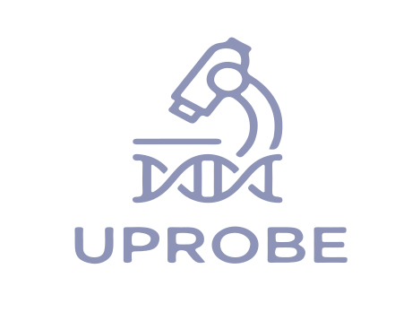

<h1 align="center">
   Universal Agentic Probe Design Platform
</h1>
<br>

[](https://github.com/UFISH-Team/U-Probe/blob/main/LICENSE)
[](https://www.python.org/downloads/)
[](https://ufish-team.github.io/uprobe-official/)
[](https://ufish-team.github.io/uprobe-official/)

**U-Probe** is a universal and agentic probe design platform tailored for imaging-based spatial-omics. It overcomes the architectural limitations of existing tools and lowers the expertise barrier by combining an innovative declarative configuration system with LLM-based AI agents.

Whether you are designing standard probes for established protocols or developing entirely novel architectures, U-Probe provides a comprehensive, automated workflow from target sequence extraction to rigorous thermodynamic filtering.

## Features

- **Universal Probe Architecture**: Features a declarative configuration system and a directed acyclic graph (DAG)-based assembly engine. Easily design arbitrary and complex multi-part probe structures (e.g., DNA-FISH, smFISH, MERFISH, seqFISH, $\pi$-FISH, MiP-seq, RCA) without modifying any source code.
- **Agentic AI Workflow**: Integrates hierarchical LLM-based AI agents (via PantheonOS) for conversational design. Users can describe experimental goals in plain language or provide scRNA-seq data, and the agents will autonomously construct configurations, select parameters, and execute the design pipeline.
- **Comprehensive Quality Filtering**: Automatically computes and filters candidates based on GC content, melting temperature, secondary structure stability (via ViennaRNA), off-target mapping (via Bowtie2), and k-mer frequency (via Jellyfish).
- **End-to-End Automation**: Streamlines the entire process from target sequence extraction to advanced post-processing, including overlap removal and equal spacing for tiling designs.
- **Extensible API & Web UI**: Offers a clean Python API for programmatic integration, a command-line interface, and an interactive web server for visual workflow management and result analysis.

## Installation

U-Probe can be easily installed via pip. We recommend using a virtual environment (like conda or venv).

### Install via pip (Recommended)

```bash
pip install uprobe
```

### Install from source (For development)

```bash
git clone https://github.com/UFISH-Team/U-Probe.git
cd U-Probe
pip install -e .
```

### Using conda environment

```bash
git clone https://github.com/UFISH-Team/U-Probe.git
cd U-Probe
conda env create -f environments.yaml
conda activate uprobe
pip install .
```

## Usage Guide

U-Probe provides flexible ways to use the tool: **Command Line Interface (CLI)**, **Python API**, and an **Interactive Web UI**. 

Before starting, ensure you have prepared two YAML configuration files:
1. **`genomes.yaml`**: Defines genome paths (FASTA, GTF, etc.).
2. **`protocol.yaml`**: Defines probe design parameters.

### 1. Command Line Interface (CLI)

The CLI is perfect for running tasks quickly in the terminal or shell scripts.

#### 🤖 AI Smart Assistant 
U-Probe includes an interactive AI Agent powered by Pantheon. You can design probes through natural language conversation without writing YAML files manually.

```bash
uprobe agent
```

#### 🌐 Start Web Server 
U-Probe now comes with a built-in web server and UI for an intuitive visual experience.

```bash
# Start in development mode (default)
uprobe server --host 127.0.0.1 --port 8000

# Start in production mode with multiple workers
uprobe server --env production --host 0.0.0.0 --port 8000 --workers 4
```

#### 🌟 Complete Workflow (Recommended)
To run the entire pipeline from genome index construction to final probe generation in one go:

```bash
uprobe run -p protocol.yaml -g genomes.yaml -o ./results --threads 10
```

#### 🔧 Step-by-Step Execution
For advanced users who need intermediate results or custom workflows, you can execute each step individually:

```bash
# 1. Build genome index
uprobe build-index -p protocol.yaml -g genomes.yaml -t 10

# 2. Validate target genes against the GTF file
uprobe validate-targets -p protocol.yaml -g genomes.yaml

# 3. Extract target region sequences
uprobe generate-targets -p protocol.yaml -g genomes.yaml -o ./results

# 4. Construct initial probes from target sequences
uprobe construct-probes -p protocol.yaml -g genomes.yaml --targets ./results/target_sequences.csv -o ./results

# 5. Post-process probes (add attributes, filter, sort)
uprobe post-process -p protocol.yaml -g genomes.yaml --probes ./results/constructed_probes.csv -o ./results

# 6. Generate visual analysis report
uprobe generate-report -p protocol.yaml -g genomes.yaml --probes ./results/probes_*.csv -o ./results
```

### 2. Python API (Ideal for Backend Integration)

If you are developing a web backend or data analysis pipeline, we recommend directly using `UProbeAPI`. It returns Pandas DataFrames, making it easy to process further.

```python
import uprobe
from pathlib import Path

# Initialize API
api = uprobe.UProbeAPI(
    protocol_config=Path("protocol.yaml"),
    genomes_config=Path("genomes.yaml"),
    output_dir=Path("./results")
)

# --- Method 1: Complete Workflow ---
df_final = api.run_workflow(threads=10)

# --- Method 2: Step-by-Step Execution ---
api.build_genome_index(threads=10)
api.validate_targets()
df_targets = api.generate_target_seqs()
df_probes = api.construct_probes(df_targets)

import pandas as pd
df_combined = pd.concat([df_targets, df_probes], axis=1)
df_final = api.post_process_probes(df_combined)

# Generate HTML/PDF report
api.generate_report(df_final)
```

## Configuration Details

U-Probe relies on two main configuration files to run. Here is a breakdown of how to structure them.

### 1. `genomes.yaml`
This file maps a genome name to its corresponding file paths. It tells U-Probe where to find the reference genome and annotation files, and which aligner indices to build.

```yaml
# Example genomes.yaml
GRCh38:
  fasta: "/path/to/GRCh38.fasta"
  gtf: "/path/to/GRCh38.gtf"
  align_index:
    - bowtie2
    - blast
  jellyfish: false  
```

### 2. `protocol.yaml`
This is the core configuration file that defines all parameters for a specific probe design run. It is highly customizable.

```yaml
# Example protocol.yaml snippet
name: my_rna_probe_design
genome: GRCh38
targets:
  - CD4

extracts:
  target_region:
    source: exon  # genome / exon / CDS / UTR
    length: 30
    overlap: 15

# Define how genes map to specific barcodes
encoding:
  CD4:
    BC1: ACGAGCCTTCCA
    BC2: CGGTAATGGACT

# Define the structure of your probes
probes:
  probe_1:
    template: "{part1}{part2}"
    parts:
      part1:
        expr: "rc(target_region[0:20])"
      part2:
        template: "CC{barcode1}TGCGTCTATTT{barcode2}TAGTGGAGCCT"
        parts:
          barcode1:
            expr: "encoding[target]['BC1']"
          barcode2:
            expr: "encoding[target]['BC2']"
  probe_2:
    template: "{part1}AGGCTCCACTA"
    parts:
      part1:
        expr: "rc(target_region[-10:])"

attributes:
  # target region attributes
  target_gcContent:
    target: target_region
    type: gc_content
  target_tm:
    target: target_region
    type: annealing_temperature

# Define filtering and sorting criteria
post_process:
  filters:
    target_tm:
      condition: target_tm >= 37 & target_tm <= 47
  sorts:
    is_ascending: 
     - target_gc
    is_descending: 
     - target_foldScore

remove_overlap:
  location_interval: 0

# Define what attributes to include in the final report
summary:
  report_name: rna_report   # rna_report / dna_report
  attributes:
    - target_foldScore
    - target_gc
```

#### Key Sections in `protocol.yaml`:
- **`name` & `genome`**: Basic metadata. The `genome` must match a key in your `genomes.yaml`.
- **`targets`**: A list of target gene names or IDs you want to design probes for.
- **`extracts`**: Parameters for extracting target sequences. The `source` can be `genome`, `exon`, `CDS`, or `UTR`. You can also define the sliding window `length` and `overlap`.
- **`encoding`**: Mapping of specific genes to custom barcodes or identifiers (e.g., assigning `BC1` and `BC2` to `CD4`).
- **`probes`**: The core of the design, powered by a **Directed Acyclic Graph (DAG)** architecture. This allows for complex, modular probe construction where parts and probes can reference each other.
  - **`template`**: Construct sequences using placeholders (e.g., `{part1}{part2}`).
  - **`expr`**: Apply Python-like expressions. You can use built-in functions like `rc()` (reverse complement), slice sequences (`[0:20]`), or fetch from the `encoding` map (`encoding[target]['BC1']`).
  - **DAG References**: Because of the DAG structure, subsequent probes or parts can dynamically reference the sequences of previously defined probes/parts in their expressions.
- **`attributes`**: Define the biochemical or physical properties you want to calculate for specific targets or probe parts. Available attribute types include:
  - `gc_content`: Calculates the GC ratio of the sequence.
  - `annealing_temperature`: Calculates the melting temperature (Tm) using Primer3.
  - `fold_score`: Calculates the RNA folding minimum free energy (MFE) using ViennaRNA (lower is more stable).
  - `self_match`: Calculates the potential for self-dimerization.
  - `mapped_sites`: Aligns the sequence to the genome (via Bowtie2) and counts off-target mapped sites.
  - `mapped_genes`: Counts the number of unique genes the sequence aligns to (via Bowtie2).
  - `kmer_count`: Counts k-mer occurrences in the genome (via Jellyfish) to evaluate specificity.
- **`post_process`**: Define strict `filters` (e.g., Tm ranges) based on the calculated attributes, and `sorts` to rank the best probes (ascending or descending).
- **`remove_overlap`**: Control the spacing between probes on the target sequence. `location_interval: 0` ensures probes do not overlap.
- **`summary`**: Define the `report_name` (e.g., `rna_report` or `dna_report`) and the specific `attributes` you want to visualize and output in the final report.

For more detailed examples and advanced configurations, please refer to the [`tests/data/*.yaml`](https://github.com/UFISH-Team/U-Probe/tree/main/tests/data "Click to visit here") directory.

## Community & Support

- 📖 **Documentation**: [uprobe.readthedocs.io](https://uprobe.readthedocs.io/)
- 💬 **GitHub Discussions**: [Ask questions and share ideas](https://github.com/UFISH-Team/U-Probe/discussions)
- 🐛 **Bug Reports**: [GitHub Issues](https://github.com/UFISH-Team/U-Probe/issues)
- 🚀 **Contributing**: See our [contributing guide](https://uprobe.readthedocs.io/en/latest/contributing.html)

## Citation

If you use U-Probe in your research, please cite our paper (or software):

```bibtex
@software{uprobe2026,
  title={U-Probe: Universal Probe Design Tool},
  author={Zhang, Qian and Xu, Weize and Cai, Huaiyuan},
  year={2025},
  url={https://github.com/UFISH-Team/U-Probe},
  version={1.0.0}
}
```
*(Note: Update the citation format with actual journal details once published.)*

## License

U-Probe is released under the [MIT License](LICENSE). See the `LICENSE` file for details.

## Acknowledgments

We thank the bioinformatics community for valuable feedback during development, and the authors of the following tools that U-Probe integrates:

- [Bowtie2](http://bowtie-bio.sourceforge.net/bowtie2/) - Fast and memory-efficient sequence alignment
- [BLAST+](https://blast.ncbi.nlm.nih.gov/) - Sequence similarity search  
- [MMseqs2](https://github.com/soedinglab/MMseqs2) - Ultra-fast and sensitive sequence search and clustering
- [Jellyfish](https://github.com/gmarcais/Jellyfish) - Fast k-mer counting
- [ViennaRNA](https://www.tbi.univie.ac.at/RNA/) - RNA secondary structure prediction
- [Primer3](https://primer3.org/) - Primer and probe design algorithms
- [FastAPI](https://fastapi.tiangolo.com/) & [Vue.js](https://vuejs.org/) - Powering our interactive Web UI


