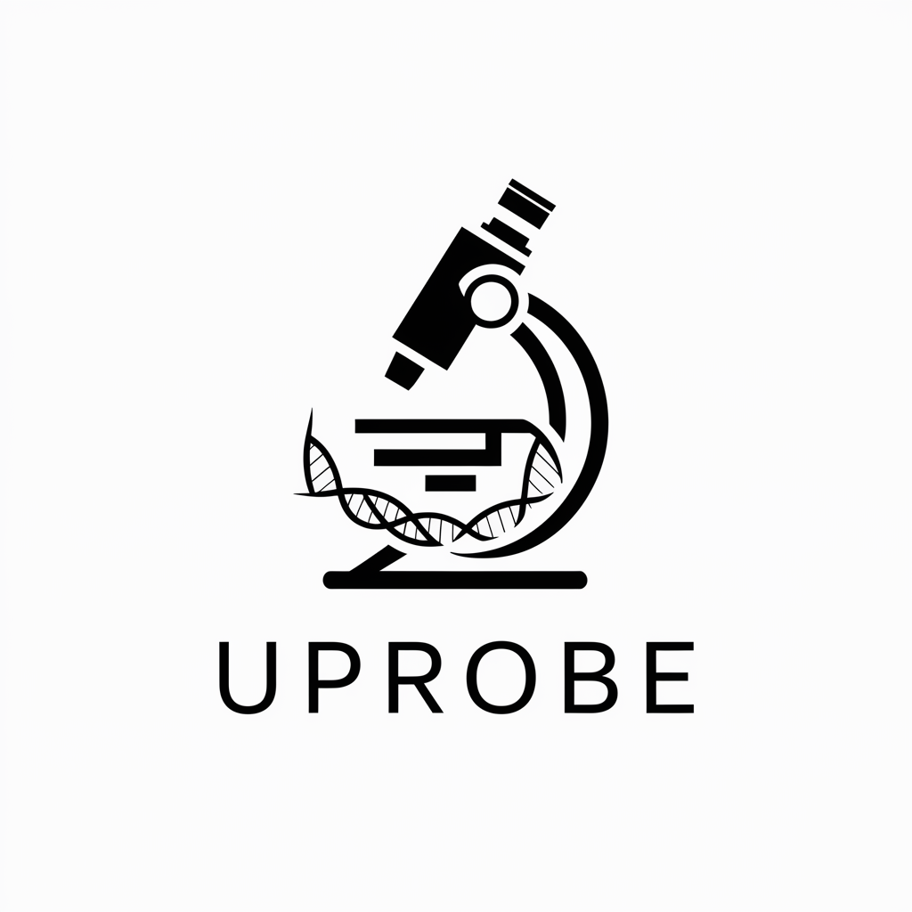

# U-Probe: Universal Probe Design Tool

<div align="center">
  
</div>

- U-Probe is a powerful and flexible Python-based tool for designing custom DNA or RNA probes for various molecular biology applications, such as *in situ* hybridization and targeted sequencing. 
- It provides a comprehensive workflow from target gene selection to final probe generation, with a focus on automation, customization, and ease of use.

## Features

- **End-to-end workflow**: Automates the entire probe design process, from sequence extraction to final filtering.
- **Highly customizable**: Use simple YAML configuration files to define target genes, probe structures, and filtering criteria.
- **Advanced filtering**: Filter probes based on a wide range of attributes like GC content, melting temperature (Tm), and off-target potential.
- **Extensible API**: In addition to a command-line interface, U-Probe offers a clean Python API for programmatic access and integration into other bioinformatics pipelines.
- **Built-in indexing**: Automatically handles the creation of genome indices for alignment tools like Bowtie2 and BLAST.

## Installation

To get started with U-Probe, clone the repository and install the required dependencies.

Using pip:

```bash
git clone https://github.com/UFISH-Team/U-Probe.git
cd u-probe
pip install -r requirements.txt
```

Using conda:
```bash
git clone https://github.com/UFISH-Team/U-Probe.git
cd u-probe
conda env create -n environments.yaml
```

*(Note: A `requirements.txt` file should be created.)*

## Quick Start (CLI)

You will need two main configuration files: `genomes.yaml` (defining the paths to your genome files) and `protocol.yaml` (defining the target genes and probe design parameters).

1.  **Prepare configuration files:**

    *   `genomes.yaml`:
        ```yaml
        human_hg38:
          fasta: "/path/to/your/hg38.fa"
          gtf: "/path/to/your/gencode.v38.annotation.gtf"
          align_index: ["bowtie2", "blast"]
        ```
    *   `protocol.yaml`:
        ```yaml
        name: "MyWorkflowName"
        genome: "hg38"
        targets:
          - "GENE1"
          - "GENE2"
        # ... other protocol parameters ...
        ```
        More detailed configurations refer to the [`tests/data/*.yaml`](https://github.com/UFISH-Team/U-Probe/tree/main/tests/data "Click to visit here") directory.

2.  **Run the workflow:**
    ```bash
    python -m uprobe \
        --genomes_yaml /path/to/your/genomes.yaml \
        --protocol_yaml /path/to/your/protocol.yaml \
        --output_dir ./results \
        --workdir ./temp_work
        --raw_csv True
    ```
    This command will generate the final probe set as a CSV file in the `./results` directory.
    If parameter `--raw_csv` is `True`, will generate raw results without filtering and sorting.

## Programmatic Usage (API)

### Core functions:

- `uprobe.api.run_workflow()`: The main entry point to execute the entire probe design process.
- `uprobe.api.build_genome_index()`: Use this to pre-build genome indices.
- `uprobe.api.get_gene_barcodes()`: A utility to extract gene-to-barcode mappings from your protocol.

### Example: Running the Workflow in Python

```python
from pathlib import Path
from uprobe.api import run_workflow
import yaml

# 1. Load configuration files (or define them as dicts)
protocol_path = Path("path/to/your/protocol.yaml")
genomes_path = Path("path/to/your/genomes.yaml")

# 2. Define output directories
output_dir = Path("./results")

# 3. Run the workflow
try:
    final_probes_df = run_workflow(
        protocol_config=protocol_path,
        genomes_config=genomes_path,
        output_dir=output_dir,
        raw_csv=True, # Optionally save raw, unfiltered probes
        continue_on_invalid_targets=False
    )
    print(f"Workflow complete. {len(final_probes_df)} probes generated.")
    print(final_probes_df.head())

except (ValueError, IOError) as e:
    print(f"An error occurred: {e}")

```

## Configuration Details

### `genomes.yaml`
This file maps a genome name to its corresponding file paths.

- `fasta`: Path to the genome FASTA file.
- `gtf`: Path to the gene annotation GTF file.
- `align_index`: A list of aligners (e.g., `bowtie2`, `blast`) for which to build indices.

### `protocol.yaml`
This file defines all parameters for a specific probe design run.

- `name`: A unique name for your experiment.
- `genome`: The name of the genome to use (must match a key in `genomes.yaml`).
- `targets`: A list of target gene names or IDs.
- `extracts`: Parameters for extracting target sequences (e.g., source, overlap, length).
- `probes`: The core of the design, defining probe templates, parts, and expressions.
- `encoding`: Mapping of genes to barcodes or other identifiers.
- `filters`: Criteria for post-processing and filtering probes (e.g., GC content, Tm).

For more detailed examples and advanced configurations, please refer to the [`tests/data/*.yaml`](https://github.com/UFISH-Team/U-Probe/tree/main/tests/data "Click to visit here") directory.
